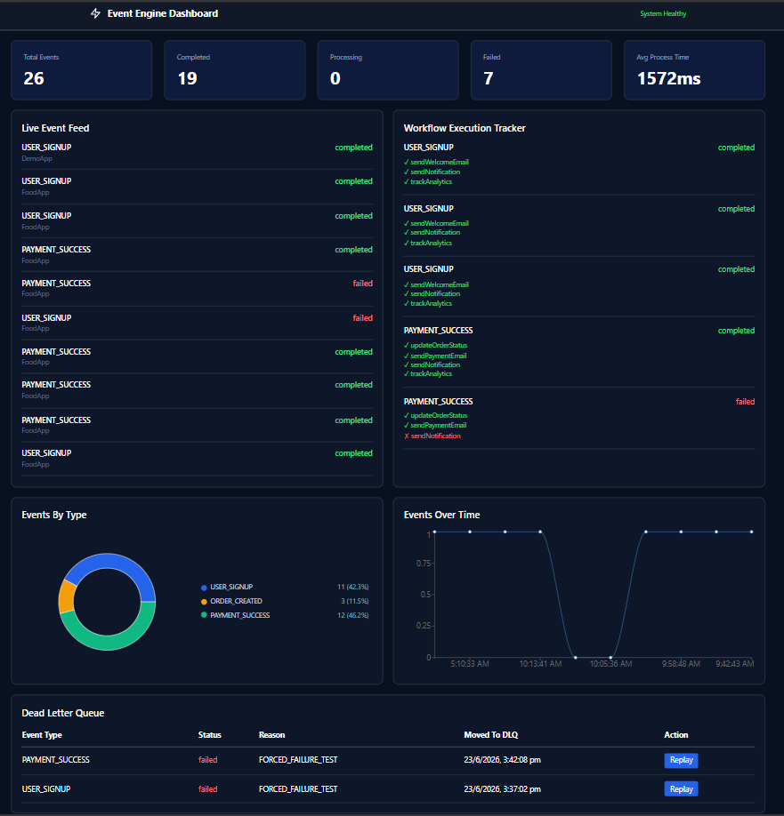
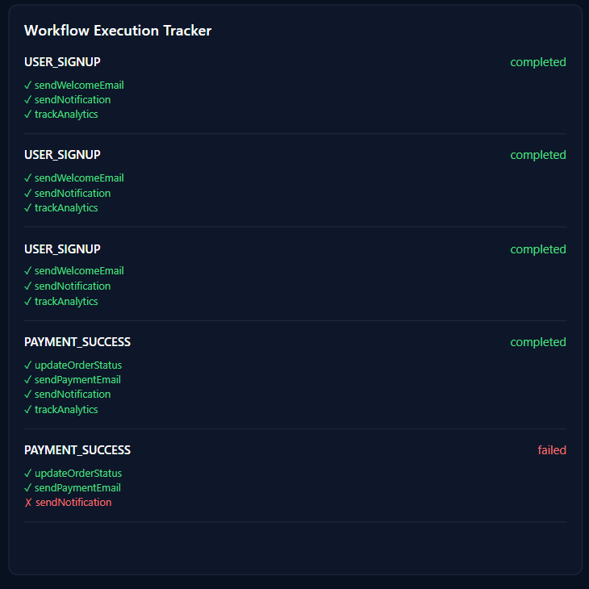
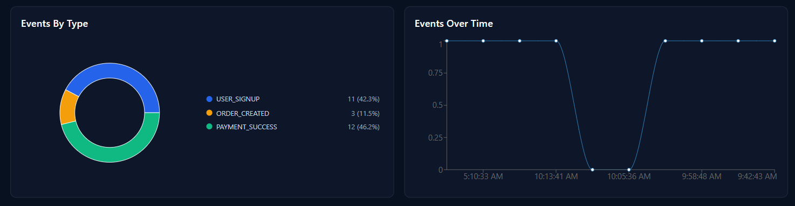
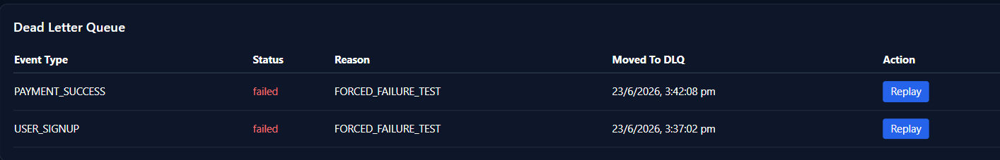

# ⚡ Event Engine

> A Production-Grade Event Processing & Workflow Orchestration Platform built using Node.js, Express.js, Redis, BullMQ, MongoDB Atlas, and React.




---

## 🌐 Live Links

- Frontend: https://event-engine-steel.vercel.app/
- Backend API: https://event-engine-backend.onrender.com
- Repository: https://github.com/VennelaSshetty/Event-Engine

---

# 🚀 Highlights

✅ Event-Driven Architecture

✅ Workflow Orchestration Engine

✅ Redis + BullMQ Queue Processing

✅ API Key Authentication

✅ Rate Limiting

✅ Idempotency Protection

✅ Concurrent Worker Processing

✅ Dead Letter Queue (DLQ)

✅ Event Replay System

✅ Real-Time Monitoring Dashboard

✅ Event Analytics & Insights

✅ Cloud Deployment using Vercel, Render, MongoDB Atlas, and Upstash Redis

---

# 📖 Overview

Modern applications continuously generate events such as user registrations, payments, notifications, and order creations.

Processing these events synchronously can lead to:

- Slow API response times
- Reduced scalability
- Increased system coupling
- Poor fault tolerance

Event Engine solves these challenges through an event-driven architecture that separates event ingestion from event processing.

Applications submit events to the platform, which validates, stores, queues, processes, tracks, and visualizes them through a centralized dashboard.

The project demonstrates real-world backend engineering concepts commonly used in modern distributed systems.

---

# 🎯 Why Event Engine?

Most applications start by directly executing business logic inside APIs.

Example:

```js
app.post("/signup", async (req, res) => {
  await sendWelcomeEmail();
  await createAnalyticsRecord();
  await sendNotification();
});
```

While simple, this approach becomes difficult to scale as systems grow.

Event Engine introduces:

- Asynchronous Processing
- Queue-Based Architecture
- Workflow Orchestration
- Failure Recovery
- Event Replay
- Distributed Processing

allowing applications to remain responsive and scalable.

---

# 🏗 System Architecture

```text
                     ┌──────────────────────┐
                     │     Client Apps      │
                     │  FoodApp / Services  │
                     └──────────┬───────────┘
                                │
                                ▼

                    ┌──────────────────────┐
                    │     API Service      │
                    │  Node.js + Express   │
                    └──────────┬───────────┘
                               │

         ┌─────────────────────┼─────────────────────┐
         │                     │                     │

         ▼                     ▼                     ▼

 Authentication         Rate Limiting        Idempotency

         │                     │                     │
         └─────────────────────┼─────────────────────┘
                               │
                               ▼

                    MongoDB Event Store

                               │
                               ▼

                    Redis Queue (BullMQ)

                               │
                               ▼

                    ┌───────────────────┐
                    │  Worker Service   │
                    │ Concurrent Jobs   │
                    └─────────┬─────────┘
                              │
                              ▼

                     Workflow Engine

                              │

       ┌──────────────────────┼──────────────────────┐
       │                      │                      │

       ▼                      ▼                      ▼

 Send Email          Send Notification      Track Analytics

       │                      │                      │
       └──────────────────────┼──────────────────────┘
                              │
                              ▼

                     Status Tracking

                              │
                              ▼

                  Dashboard & Monitoring
```

---

# 🔄 Event Lifecycle

```text
Client Request
      │
      ▼
API Authentication
      │
      ▼
Rate Limiting
      │
      ▼
Idempotency Validation
      │
      ▼
Store Event in MongoDB
      │
      ▼
Push Job to Redis Queue
      │
      ▼
Worker Picks Job
      │
      ▼
Workflow Execution
      │
      ▼
Update Event Status
      │
      ▼
Dashboard & Analytics
```

---

# ⚙ Workflow Engine

One of the core components of Event Engine is the Workflow Engine.

Instead of hardcoding business logic:

```js
if (eventType === "USER_SIGNUP") {
  sendWelcomeEmail();
}
```

The platform uses configurable workflows:

```json
{
  "USER_SIGNUP": [
    "sendWelcomeEmail",
    "sendNotification",
    "trackAnalytics"
  ],

  "PAYMENT_SUCCESS": [
    "sendPaymentEmail",
    "sendNotification",
    "trackAnalytics"
  ],

  "ORDER_CREATED": [
    "sendNotification",
    "trackAnalytics"
  ]
}
```

Execution Flow:

```text
Event
 ↓
Workflow Engine
 ↓
Load Workflow
 ↓
Resolve Actions
 ↓
Execute Actions
 ↓
Update Status
```

Benefits:

- Extensible Design
- Cleaner Business Logic
- Easier Maintenance
- Workflow Reusability
- Better Scalability

---

# 🔒 Reliability Features

## API Key Authentication

Only authorized applications can publish events.

Every request requires:

```http
x-api-key
```

The platform validates:

- Key existence
- Active status
- Application authorization

---

## Rate Limiting

Protects the system against abuse and excessive traffic.

Benefits:

- Prevents spam requests
- Preserves worker capacity
- Improves platform stability

---

## Idempotency Protection

Every request must include a unique idempotency key.

Example:

```http
idempotency-key: signup_123
```

If the same event is submitted multiple times using the same key:

```text
First Request  → Accepted
Second Request → Rejected as Duplicate
```

This prevents:

- Duplicate emails
- Duplicate payments
- Duplicate workflow executions

---

## Retry Mechanism

Failed jobs are automatically retried before being marked as failed.

Benefits:

- Temporary failure recovery
- Increased reliability
- Reduced manual intervention

---

## Dead Letter Queue (DLQ)

Jobs that continue failing after retry attempts are moved to the Dead Letter Queue.

```text
Event
 ↓
Retry
 ↓
Retry
 ↓
Retry
 ↓
DLQ
```

Benefits:

- No silent failures
- Easier debugging
- Recovery support

---

## Event Replay

Failed events can be replayed and reprocessed.

```text
Failed Event
     ↓
Replay
     ↓
Queue
     ↓
Worker
     ↓
Workflow Execution
```

Use Cases:

- Bug Fix Validation
- Recovery Operations
- Historical Reprocessing

---

# ⚡ Scalability Features

## Redis Queue

BullMQ and Redis are used to decouple ingestion from processing.

Benefits:

- Faster APIs
- Reliable Delivery
- Better Throughput

---

## Concurrent Workers

Multiple jobs can be processed simultaneously.

```text
Worker 1
Worker 2
Worker 3
Worker 4
```

Benefits:

- Increased throughput
- Improved performance
- Horizontal scaling readiness

---

## Distributed Processing

API services and workers operate independently.

This architecture allows processing workloads to scale without affecting API responsiveness.

---

# 📊 Dashboard Features

The React dashboard provides complete visibility into platform activity.

---

## Dashboard Overview


Features:

- Total Events
- Completed Events
- Failed Events
- Processing Events
- Average Processing Time

---

## Workflow Execution Tracker



Tracks execution of workflow actions in real time.

Example:

```text
USER_SIGNUP

✓ sendWelcomeEmail
✓ sendNotification
✓ trackAnalytics
```

---

## Analytics Dashboard



Provides:

- Event Distribution
- Event Activity Timeline
- Processing Insights

---

## Dead Letter Queue



Displays:

- Failed Events
- Failure Reasons
- Replay Actions

---

# 🔑 API Documentation

## Demo API Key

```text
sk_demo_eventengine_7c4f92b18e5d
```

---

## Supported Event Types

### USER_SIGNUP

```json
{
  "type": "USER_SIGNUP",
  "idempotencyKey": "user_84",
  "payload": {
    "userId": "user_59",
    "email": "pra@example.com"
  }
}
```

---

### PAYMENT_SUCCESS

```json
{
  "type": "PAYMENT_SUCCESS",
  "idempotencyKey": "pay_262",
  "payload": {
    "paymentId": "pay_59",
    "email": "pra@example.com",
    "orderId": "order_19"
  }
}
```

---

### ORDER_CREATED

```json
{
  "type": "ORDER_CREATED",
  "idempotencyKey": "order_992",
  "payload": {
    "email": "pra@example.com",
    "orderId": "order_19",
    "amount": 890
  }
}
```

---

## Sample Request

```bash
curl -X POST https://event-engine-backend.onrender.com/api/events \
-H "Content-Type: application/json" \
-H "x-api-key: sk_demo_eventengine_7c4f92b18e5d" \
-d '{
  "type":"USER_SIGNUP",
  "idempotencyKey":"user_84",
  "payload":{
    "userId":"user_59",
    "email":"pra@example.com"
  }
}'
```

---

## Important Note

Every event must contain a unique:

```text
idempotencyKey
```

Reusing an existing key will result in duplicate protection logic preventing reprocessing.

---

# 🛠 Tech Stack

| Layer | Technology |
|---------|------------|
| Frontend | React.js |
| Build Tool | Vite |
| Styling | Tailwind CSS |
| Charts | Recharts |
| Backend | Node.js |
| API Framework | Express.js |
| Database | MongoDB Atlas |
| Queue | BullMQ |
| Message Broker | Redis |
| Redis Provider | Upstash |
| Backend Hosting | Render |
| Frontend Hosting | Vercel |

---

# 📂 Project Structure

```text
event-engine
│
├── backend
│   │
│   ├── src
│   │   ├── api
│   │   │   ├── controllers
│   │   │   ├── routes
│   │   │   └── middleware
│   │   │
│   │   ├── actions
│   │   ├── workflows
│   │   ├── workers
│   │   ├── queues
│   │   ├── models
│   │   ├── services
│   │   ├── config
│   │   └── utils
│
├── frontend
│   ├── src
│   ├── pages
│   ├── components
│   ├── charts
│   └── services
│
├── screenshots
│
└── README.md
```

---

# ☁ Deployment Architecture

```text
Frontend (Vercel)
        │
        ▼

Backend API (Render)
        │
        ▼

MongoDB Atlas

        │

Redis Queue (Upstash)

        │

Worker Service (Render)
```

---

# 📈 Engineering Concepts Demonstrated

- Event-Driven Architecture
- Workflow Orchestration
- Queue-Based Processing
- Distributed Systems
- Reliability Engineering
- API Authentication
- Idempotency Patterns
- Dead Letter Queues
- Event Replay
- Concurrent Processing
- Cloud Deployment
- Scalable Backend Design

---

# 🚀 Local Setup

## Clone Repository

```bash
git clone https://github.com/VennelaSshetty/Event-Engine.git
```

```bash
cd Event-Engine
```

---

## Install Dependencies

### Backend

```bash
cd backend
npm install
```

### Frontend

```bash
cd frontend
npm install
```

---

## Environment Variables

Create a `.env` file in the backend directory:

```env
PORT=5000

MONGO_URI=your_mongodb_connection_string

REDIS_URL=your_redis_connection_string

API_KEY=your_api_key

QUEUE_NAME=queue_name

RETRY_ATTEMPTS=5
RETRY_DELAY=5000

WORKER_CONCURRENCY=5
```

### Variable Description

| Variable | Description |
|-----------|------------|
| PORT | Backend server port |
| MONGO_URI | MongoDB Atlas connection string |
| REDIS_URL | Upstash Redis connection string |
| API_KEY | Valid application API key |
| QUEUE_NAME | BullMQ queue name |
| RETRY_ATTEMPTS | Number of retry attempts before failure |
| RETRY_DELAY | Delay between retry attempts (ms) |
| WORKER_CONCURRENCY | Number of jobs processed concurrently |
```

## Start Backend

```bash
npm run dev
```

---

## Start Worker

```bash
npm run worker
```

---

## Start Frontend

```bash
npm run dev
```

---

# 🔮 Future Improvements

- Kafka Integration
- OpenTelemetry Monitoring
- Distributed Tracing
- Advanced Workflow Builder
- Multi-Tenant Dashboard
- Enhanced Analytics
- Workflow Versioning

---

# 💡 Key Takeaways

Event Engine evolved from a simple event ingestion API into a complete event-driven workflow orchestration platform. The project demonstrates real-world backend engineering concepts such as asynchronous processing, queue-based architectures, workflow execution, failure recovery, distributed processing, and cloud deployment while maintaining observability through a modern monitoring dashboard.
