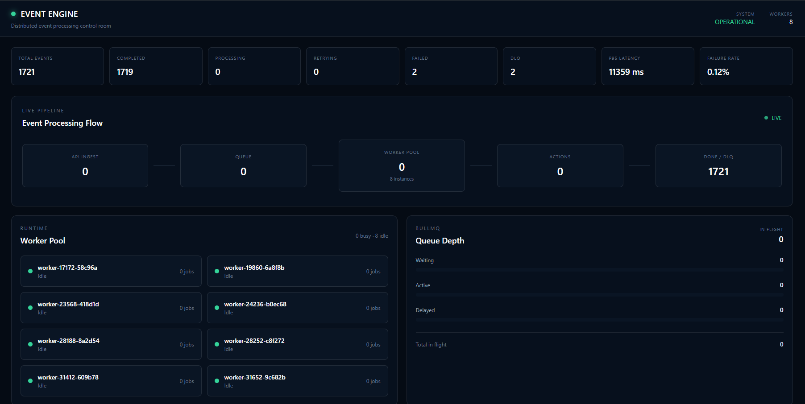
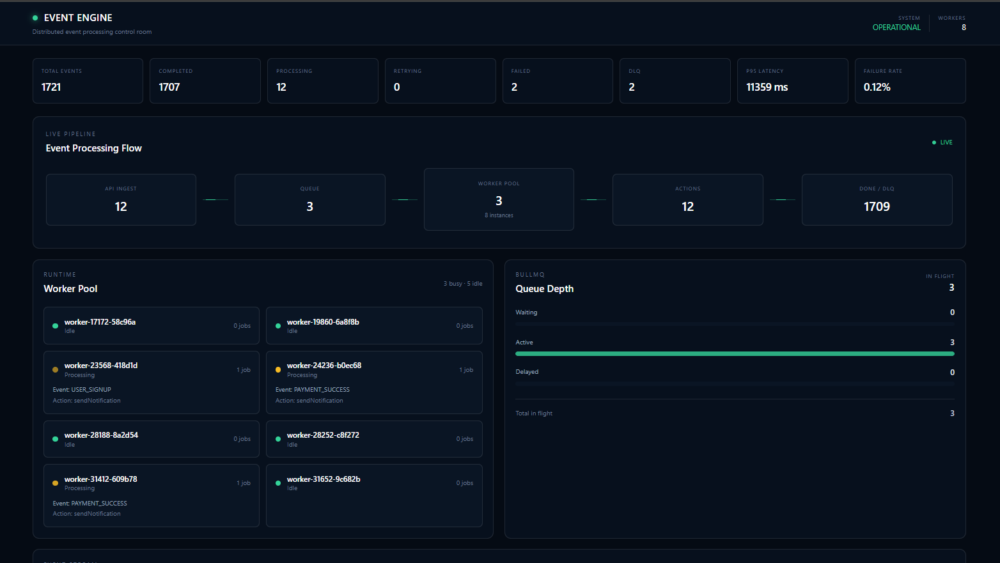
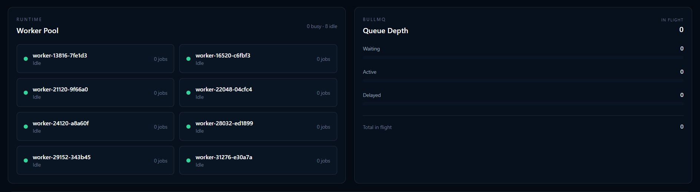
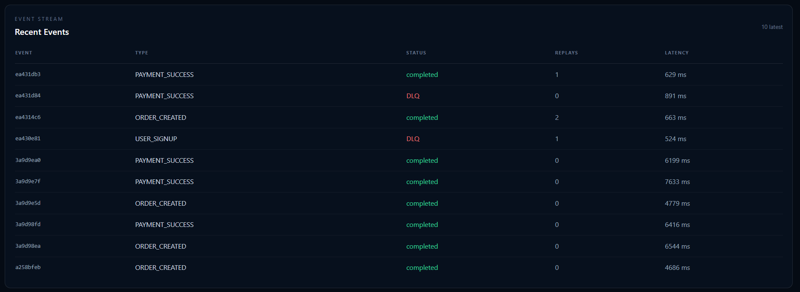
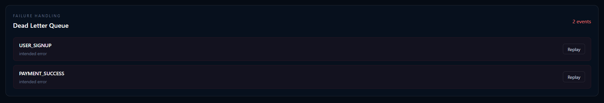
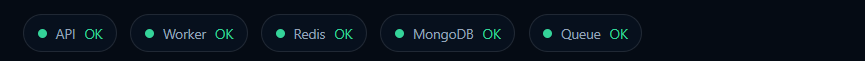
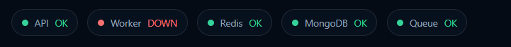
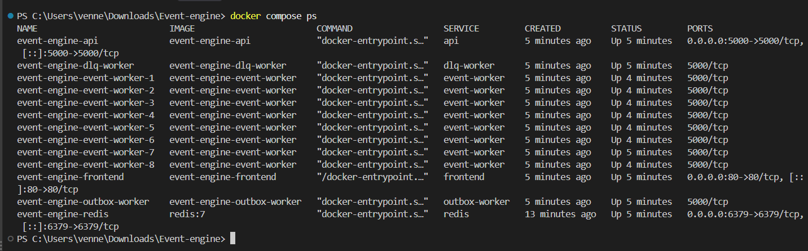

# ⚡ Event Engine

> A distributed event-processing and workflow-orchestration platform built with Node.js, Express, BullMQ, Redis, MongoDB and React.




---

## 🌐 Live Demo

| | Link |
|---|---|
| Dashboard (Vercel) | https://event-engine-steel.vercel.app/ |
| Backend API (Render) | https://event-engine-backend.onrender.com |
| Repository | https://github.com/VennelaSshetty/Event-Engine |

> ⏳ The backend runs on a free Render instance. If it has been idle, the first request can take 30–60 seconds while it wakes up.

---

## 📑 Table of Contents

1. [What is Event Engine?](#-what-is-event-engine)
2. [Key Features](#-key-features)
3. [Architecture](#-architecture)
4. [Event Lifecycle](#-event-lifecycle)
5. [Workflow Engine](#-workflow-engine)
6. [Reliability Design](#-reliability-design)
7. [Dashboard Tour](#-dashboard-tour)
8. [Quick Start with Docker (recommended)](#-quick-start-with-docker-recommended)
9. [Scaling Workers](#-scaling-workers)
10. [Run Manually (without Docker)](#-run-manually-without-docker)
11. [Environment Variables](#-environment-variables)
12. [Email Notifications (Mailtrap)](#-email-notifications-mailtrap)
13. [API Reference](#-api-reference)
14. [Testing](#-testing)
15. [Load Testing and Benchmarks](#-load-testing-and-benchmarks)
16. [Troubleshooting](#-troubleshooting)
17. [Tech Stack](#-tech-stack)
18. [Project Structure](#-project-structure)
19. [Future Improvements](#-future-improvements)

---

## 📖 What is Event Engine?

Modern applications constantly generate events: a user signs up, a payment succeeds, an order is created. Handling all of that inside the API request makes responses slow and fragile:

```js
// ❌ The naive approach
app.post("/signup", async (req, res) => {
  await sendWelcomeEmail();       // slow
  await createAnalyticsRecord();  // can fail
  await sendNotification();       // blocks the user
  res.send("ok");
});
```

**Event Engine separates *receiving* an event from *processing* it.**

1. An app sends an event to the API.
2. The API authenticates it, rejects duplicates, stores it and puts it on a queue, then responds immediately.
3. Independent **workers** pick the event up and run the matching **workflow** (email, notification, analytics, ...).
4. Every step is tracked, retried on failure, and visible in a live dashboard.

---

## 🚀 Key Features

**Ingestion & security**
- API key authentication (`x-api-key`)
- Per-key rate limiting
- Idempotency keys to prevent duplicate events

**Processing**
- Asynchronous processing with Redis + BullMQ
- Config-driven, **versioned** workflow engine (no hard-coded `if/else` per event type)
- Sequential and parallel action stages
- Horizontally scalable workers with controlled concurrency
- Redis caching of workflow configuration

**Reliability**
- Automatic retries with exponential backoff (`RETRYING` status)
- Retryable vs non-retryable error classification
- Dead Letter Queue (DLQ) so no failure is lost silently
- Event replay from the dashboard
- Atomic workflow-execution creation (no duplicate execution on concurrent workers)
- Resume-on-retry: actions that already completed are not run again
- Circuit breaker around the email provider

**Observability**
- Live dashboard: totals, p95 latency, failure rate
- Worker pool and BullMQ queue-depth view
- Workflow action tracker
- System health indicators (API, Worker, Redis, MongoDB, Queue)
- Metrics service and health endpoints

**Quality & operations**
- Automated Jest test suite for the riskiest logic
- GitHub Actions CI pipeline
- One-command Docker Compose setup
- Scale workers with a single flag
- Deployed on Vercel + Render + MongoDB Atlas + Upstash Redis

---

## 🏗 Architecture

```text
 ┌─────────────────┐
 │   Client Apps   │   POST /api/events
 └────────┬────────┘
          ▼
 ┌─────────────────────────────────────────┐
 │               API Service               │
 │  Auth → Rate Limit → Idempotency Check  │
 └────────┬────────────────────────────────┘
          │ save event               ┌──────────────┐
          ├─────────────────────────▶│   MongoDB    │ (events, executions, DLQ)
          │ enqueue job              └──────────────┘
          ▼
 ┌─────────────────┐
 │  Redis (BullMQ) │   queue + cached workflow configs
 └────────┬────────┘
          ▼
 ┌─────────────────────────────────────────┐
 │   Worker Pool  (event-worker × N)       │
 │   Planner → Executor → Action Registry  │
 └────────┬────────────────────────────────┘
          ▼
   Actions: Email · Notification · Analytics · Order Status
          │
          ▼
 Status updates → MongoDB → React Dashboard
          │
   (on final failure) → Dead Letter Queue
```

**Three kinds of worker processes:**

| Worker | Responsibility |
|---|---|
| `event-worker` | Runs workflows for queued events. This is the one you scale. |
| `outbox-worker` | Reliably hands saved events over to the queue (outbox pattern). |
| `dlq-worker` | Handles jobs that exhausted all retries. |

---

## 🔄 Event Lifecycle

```text
Client request
   │
   ▼
API key check ──✗──▶ 401 Unauthorized
   │
   ▼
Rate limit ─────✗──▶ 429 Too Many Requests
   │
   ▼
Idempotency check ──duplicate──▶ returns the original event, nothing reprocessed
   │
   ▼
Save event (status: pending) → enqueue job
   │
   ▼
Worker picks job (status: processing)
   │
   ▼
Workflow runs  ──error──▶ status: retrying → backoff → retry
   │                                   │
   ▼                                   ▼ (retries exhausted / non-retryable)
status: completed                 status: failed → Dead Letter Queue → replay
```

---

## ⚙ Workflow Engine

Workers contain **no business logic**. They only execute workflows that are defined in configuration (`backend/src/config/workflows.js`).

A workflow is a list of **stages**, called a `sequence`. Stages run **one after another**. Actions that share a stage run **in parallel**.

```js
const workflows = {
  ORDER_CREATED: {
    1: {                                   // version 1
      sequence: [
        ["sendOrderEmail", "sendNotification"],   // stage 1: both run in parallel
        ["trackAnalytics"]                        // stage 2: runs after stage 1
      ]
    }
  },
  // ...
};

export const CURRENT_VERSION = 1;
```

### Supported workflows

| Event type | Version | Execution plan |
|---|---|---|
| `USER_SIGNUP` | 1 | `sendWelcomeEmail` → `sendNotification` → `trackAnalytics` |
| `USER_SIGNUP` | 2 | `sendWelcomeEmail` → `trackAnalytics` |
| `ORDER_CREATED` | 1 | (`sendOrderEmail` ‖ `sendNotification`) → `trackAnalytics` |
| `PAYMENT_SUCCESS` | 1 | `updateOrderStatus` → (`sendPaymentEmail` ‖ `sendNotification`) → `trackAnalytics` |

`→` means "then" (sequential). `‖` means "at the same time" (parallel).

```text
PAYMENT_SUCCESS (v1)

Stage 1:              updateOrderStatus
                              ↓
Stage 2 (parallel):   sendPaymentEmail  ║  sendNotification
                              ↓
Stage 3:              trackAnalytics
```

This gives safe ordering (for example, analytics only after the order is updated and the email/notification stage is done) while still getting parallel speed where it is safe.

### Workflow versioning

Workflows are versioned per event type, so you can change a workflow without breaking events that are already in flight.

- When an event's workflow execution is first created, it is **stamped with the workflow version** at that moment.
- Retries and replays always use the **stored version**, never "whatever is current now".
- Changing `CURRENT_VERSION` only affects **new** executions.

For example, if an execution started on `USER_SIGNUP` v1 and you later switch the system to v2, that execution still finishes using v1's actions. This behavior is covered by an automated test (`workflowVersioning.test.js`).

### Adding a new workflow

Add the action module under `src/actions/`, register it, and add a definition to `workflows.js`. Worker code does not change. Workflow definitions are validated (`validators/validateWorkflows.js`) so a bad config is caught early.

---

## 🛡 Reliability Design

| Problem | How Event Engine handles it |
|---|---|
| Same event sent twice | Unique `idempotencyKey`; duplicates return the original event |
| Two workers start the same workflow | Atomic upsert on a unique `eventId` index |
| Temporary failure (network, provider) | Automatic retries with exponential backoff |
| Failure that can never succeed (e.g. unknown action) | `NonRetryableError` goes straight to the DLQ |
| Worker crashes mid-job | BullMQ stalled-job detection re-queues the job |
| Retry after partial success | Completed actions are skipped, only the remaining ones run |
| Parallel action fails | `Promise.allSettled` aggregates results, one final decision is made |
| Email provider keeps failing | Circuit breaker opens after repeated failures, then recovers after a cooldown |
| Workflow changed while events are in flight | Each execution is pinned to the version it started with |
| Needs reprocessing after a bug fix | Replay from the DLQ / dashboard |
| Need to trace one request | `correlationId` carried through API → queue → worker → logs |

---

## 📊 Dashboard Tour

The React dashboard shows what is flowing, what is healthy and what is failing.

### 1. Overview


Top-line numbers: **Total Events, Completed, Processing, Retrying, Failed, DLQ, P95 Latency, Failure Rate**, plus overall system status and active worker count.

### 2. Live Pipeline


Shows events moving through each stage in real time: **API Ingest → Queue → Worker Pool → Actions → Done / DLQ**.

### 3. Worker Pool and Queue Depth


- **Worker Pool:** every running worker instance, whether it is busy or idle, and how many jobs it handled.
- **Queue Depth:** BullMQ *waiting*, *active* and *delayed* jobs, plus total in flight.

### 4. Recent Events


The latest events with type, status, replay count and end-to-end latency.

### 5. Dead Letter Queue


Events that failed all retries, with the failure reason and a **Replay** action.

### 6. System Health Bar
The bar at the bottom of the dashboard shows the status of **API, Worker, Redis, MongoDB and Queue**, and a summary of overall worker health.

**All systems active:**



**No worker running** (the dashboard clearly warns you that events will not be processed):



### 7. Docker Compose


All services (Mongo, Redis, API, workers, frontend) running from a single command.

---

## 🐳 Quick Start with Docker (recommended)

The whole system, including MongoDB, Redis, API, all workers and the dashboard, starts with **one command**. You do not need to install Node.js, MongoDB or Redis.

### Prerequisites
- [Docker](https://docs.docker.com/get-docker/) and Docker Compose installed
- Git

### Steps

```bash
# 1. Clone
git clone https://github.com/VennelaSshetty/Event-Engine.git
cd Event-Engine

# 2. Start everything
docker compose up --build
```

Once the containers are up, open:

| What | URL |
|---|---|
| **Dashboard** | http://localhost (or http://127.0.0.1) |
| **API base URL** | http://127.0.0.1:5000 |
| **Send events to** | http://127.0.0.1:5000/api/events |

Check that everything is running:

```bash
docker compose ps
```

Stop everything:

```bash
docker compose down
```

> 💡 No Mailtrap account or paid service is needed to try the project. Email sending is disabled by default (see [Email Notifications](#-email-notifications-mailtrap)).

---

## 📈 Scaling Workers

Event Engine scales horizontally: more worker containers means more events processed in parallel. BullMQ locks each job so two workers never process the same job.

Run **8 event workers**:

```bash
docker compose up --build --scale event-worker=8
```

Run **3 event workers**:

```bash
docker compose up --build --scale event-worker=3
```

Scale a running system without rebuilding:

```bash
docker compose up -d --scale event-worker=8
```

Open the dashboard, and the **Worker Pool** panel will show all 8 instances (`0 busy · 8 idle` when no load).

There are two levels of parallelism:

| Setting | Meaning |
|---|---|
| `--scale event-worker=N` | Number of worker **processes/containers** |
| `WORKER_CONCURRENCY` | Number of jobs **each** worker handles at the same time |

Total parallel jobs ≈ `N × WORKER_CONCURRENCY`.

---

## 🖥 Run Manually (without Docker)

Use this if you want to run each part yourself for development.

### Prerequisites
- Node.js 18+
- A MongoDB instance (local or [MongoDB Atlas](https://www.mongodb.com/atlas))
- A Redis instance (local, or [Upstash](https://upstash.com/))

### 1. Clone and install

```bash
git clone https://github.com/VennelaSshetty/Event-Engine.git
cd Event-Engine

cd backend && npm install
cd ../frontend && npm install
```

### 2. Configure environment

Create `backend/.env` and `frontend/.env` (see [Environment Variables](#-environment-variables)).

If your database does not have an API key yet, create one:

```bash
cd backend
node scripts/createApiKey.js
```

### 3. Start each component

You need **5 terminals**. All backend commands run from the `backend` folder.

| # | Component | Command |
|---|---|---|
| 1 | **API server** | `npm run dev` |
| 2 | **Event worker** | `node src/workers/eventWorker.js` |
| 3 | **Outbox worker** | `node src/workers/outboxWorker.js` |
| 4 | **DLQ worker** | `node src/workers/dlqWorker.js` |
| 5 | **Frontend** (from `frontend/`) | `npm run dev` |

```bash
# Terminal 1 - API
cd backend
npm run dev

# Terminal 2 - Event worker
cd backend
node src/workers/eventWorker.js

# Terminal 3 - Outbox worker
cd backend
node src/workers/outboxWorker.js

# Terminal 4 - DLQ worker
cd backend
node src/workers/dlqWorker.js

# Terminal 5 - Frontend
cd frontend
npm run dev
```

When running the frontend manually with Vite, the dashboard is at **http://localhost:5173**. The API runs at **http://127.0.0.1:5000**.

To run more event workers manually, start `node src/workers/eventWorker.js` in additional terminals.

> ⚠️ **If no worker is running**, the API will still accept events (status stays `pending`), but nothing will process them and the dashboard will show **Worker down**. Start the workers and the backlog is processed automatically.

---

## 🔧 Environment Variables

### Backend: `backend/.env`

```dotenv
# Server
PORT=5000

# Database and queue
MONGO_URI=your_mongodb_connection_string
REDIS_URL=your_redis_connection_string
QUEUE_NAME=event-queue

# Reliability
RETRY_ATTEMPTS=5
RETRY_DELAY=5000
WORKER_CONCURRENCY=5

# Load testing scripts
BENCHMARK_API_URL=http://localhost:5000/api/events
BENCHMARK_API_KEY=sk_demo_eventengine_7c4f92b18e5d

# Email (Mailtrap sandbox). Currently disabled, see "Email Notifications"
MAIL_HOST=your_mailtrap_smtp_host
MAIL_PORT=2525
MAIL_USER=your_mailtrap_user
MAIL_PASS=your_mailtrap_password
MAIL_FROM=your_from_address
MAIL_ENABLED=false

# Circuit breaker (email provider)
CIRCUIT_BREAKER_FAILURE_THRESHOLD=3
CIRCUIT_BREAKER_COOLDOWN=10000
```

| Variable | Description |
|---|---|
| `PORT` | API server port |
| `MONGO_URI` | MongoDB connection string |
| `REDIS_URL` | Redis connection string |
| `QUEUE_NAME` | BullMQ queue name |
| `RETRY_ATTEMPTS` | Retries before an event is marked failed and sent to the DLQ |
| `RETRY_DELAY` | Base delay (ms) for exponential backoff |
| `WORKER_CONCURRENCY` | Jobs processed in parallel by each worker |
| `BENCHMARK_API_URL` | Endpoint the load-test script sends events to |
| `BENCHMARK_API_KEY` | API key the load-test script uses |
| `MAIL_HOST` / `MAIL_PORT` | Mailtrap SMTP host and port |
| `MAIL_USER` / `MAIL_PASS` | Mailtrap SMTP credentials |
| `MAIL_FROM` | Sender address on outgoing mail |
| `MAIL_ENABLED` | `true` to send real emails, `false` to simulate them |
| `CIRCUIT_BREAKER_FAILURE_THRESHOLD` | Consecutive email failures before the breaker opens |
| `CIRCUIT_BREAKER_COOLDOWN` | Time (ms) the breaker stays open before testing recovery |

### Frontend: `frontend/.env`

```dotenv
VITE_API_BASE_URL=http://127.0.0.1:5000
```

| Variable | Description |
|---|---|
| `VITE_API_BASE_URL` | Base URL of the backend API the dashboard talks to |

When using Docker Compose, MongoDB and Redis run as containers and the services are already wired together in `docker-compose.yml`.

---

## ✉ Email Notifications (Mailtrap)

Event Engine sends emails through **Mailtrap** (SMTP sandbox) using Nodemailer.

**Real email sending is currently disabled** (`MAIL_ENABLED=false`). Mailtrap's free plan allows only about 50 emails, which a load test uses up almost immediately. While disabled:

- Email actions still run as part of the workflow.
- The email is **simulated** (logged instead of sent), so workflows complete normally and the dashboard behaves exactly the same.
- Nothing else in the system is affected.

**To enable real emails**, create a free [Mailtrap](https://mailtrap.io/) account, copy your sandbox SMTP credentials, and set them in `backend/.env`:

```dotenv
MAIL_HOST=sandbox.smtp.mailtrap.io
MAIL_PORT=2525
MAIL_USER=your_mailtrap_user
MAIL_PASS=your_mailtrap_password
MAIL_FROM=noreply@eventengine.dev
MAIL_ENABLED=true
```

Restart the workers, send an event, and the email will appear in your Mailtrap inbox.

**Circuit breaker:** email calls are wrapped in a circuit breaker. After `CIRCUIT_BREAKER_FAILURE_THRESHOLD` consecutive failures it opens and stops calling the provider for `CIRCUIT_BREAKER_COOLDOWN` ms, then lets a trial request through to check whether the provider has recovered. This stops a failing email provider from slowing down or stalling the workers.

---

## 🔑 API Reference

### Authentication

Every request must include an API key header.

```http
x-api-key: sk_demo_eventengine_7c4f92b18e5d
```

> This is a public **demo** key for trying the project.

### `POST /api/events`: submit an event

| Environment | URL |
|---|---|
| Local (Docker or manual) | `http://127.0.0.1:5000/api/events` |
| Live demo | `https://event-engine-backend.onrender.com/api/events` |

**Headers**

| Header | Required | Description |
|---|---|---|
| `Content-Type` | yes | `application/json` |
| `x-api-key` | yes | Your API key |

**Body**

| Field | Description |
|---|---|
| `type` | `USER_SIGNUP`, `PAYMENT_SUCCESS` or `ORDER_CREATED` |
| `idempotencyKey` | A **unique** string per logical event |
| `payload` | Event data (see examples below) |

### Sending events with Postman

1. Create a new request: method **POST**, URL `http://127.0.0.1:5000/api/events`.
2. Under **Headers**, add `x-api-key` with your API key, and `Content-Type: application/json`.
3. Under **Body**, choose **raw** → **JSON** and paste one of the payloads below.
4. Click **Send**, then watch the event move through the dashboard.

**`ORDER_CREATED`**
```json
{
  "type": "ORDER_CREATED",
  "idempotencyKey": "order_13126",
  "payload": {
    "email": "vennu@example.com",
    "orderId": "order_19",
    "amount": 890
  }
}
```

**`PAYMENT_SUCCESS`**
```json
{
  "type": "PAYMENT_SUCCESS",
  "idempotencyKey": "pay_1278311",
  "payload": {
    "paymentId": "pay_1672",
    "orderId": "order_9802",
    "email": "vinith@example.com"
  }
}
```

**`USER_SIGNUP`**
```json
{
  "type": "USER_SIGNUP",
  "idempotencyKey": "user_91",
  "payload": {
    "userId": "user_9",
    "email": "vidhi@example.com"
  }
}
```

### Sending events with cURL

```bash
curl -X POST http://127.0.0.1:5000/api/events \
  -H "Content-Type: application/json" \
  -H "x-api-key: sk_demo_eventengine_7c4f92b18e5d" \
  -d '{
    "type": "USER_SIGNUP",
    "idempotencyKey": "user_92",
    "payload": {
      "userId": "user_10",
      "email": "demo@example.com"
    }
  }'
```

To try the live deployment instead, replace the URL with `https://event-engine-backend.onrender.com/api/events`.

### ⚠ Idempotency keys must be unique

Reusing an `idempotencyKey` is treated as a duplicate: the original event is returned and **nothing is processed again**. If you are testing and nothing seems to happen, use a new key each time (for example `user_93`, `user_94`, ...).

### Common responses

| Status | Meaning |
|---|---|
| `2xx` | Event accepted (or duplicate of an existing event) |
| `401` | Missing or invalid API key |
| `429` | Rate limit exceeded |

### Health endpoints

| Endpoint | Purpose |
|---|---|
| `GET /live` | Is the process alive? (restart me if not) |
| `GET /ready` | Are MongoDB, Redis and the queue reachable? (route traffic to me?) |
| `GET /health` | Combined health status |

---

## 🧪 Testing

The project includes an automated **Jest** test suite that targets the parts of the system where a bug would hurt most: duplicate processing, concurrency, retries and failure handling.

```bash
cd backend
npm test
```

| Test file | What it proves |
|---|---|
| `idempotency.test.js` | Sending the same `idempotencyKey` twice does not create or process a second event |
| `workflow.test.js` | Workflows resolve to the correct stages and actions for each event type |
| `workflowResume.test.js` | If a workflow fails midway, a retry skips actions that already completed and runs only the rest |
| `workflowVersioning.test.js` | An execution stays pinned to the workflow version it started with, even after the current version changes |
| `dlq.test.js` | A non-retryable error goes to the Dead Letter Queue without exhausting retries |
| `circuitBreaker.test.js` | The email circuit breaker opens after repeated failures and recovers after the cooldown |

Tests also run automatically on every push through **GitHub Actions** (`.github/workflows/ci.yml`), and the build fails if any test fails.

---

## 📉 Load Testing and Benchmarks

The `backend/scripts/` folder contains tools for stress-testing and debugging the pipeline:

| Script | Purpose |
|---|---|
| `loadTest.js` | Fires many events at the API with unique idempotency keys to measure throughput and latency |
| `bulkEventTest.js` | Sends events in bulk |
| `checkQueue.js` / `queueDebug.js` | Inspect BullMQ queue state |
| `cleanQueue.js` | Clear the queue between runs |
| `createApiKey.js` | Create a new API key in the database |

Run a load test (the target URL and key come from `BENCHMARK_API_URL` and `BENCHMARK_API_KEY` in `.env`):

```bash
cd backend
node scripts/loadTest.js
```

Measured results (baseline, after DB optimization, after Redis caching) are recorded in [`BENCHMARKS.md`](./BENCHMARKS.md).

> Remember to keep `MAIL_ENABLED=false` while load testing, otherwise the Mailtrap free quota is used up immediately.

---

## 🩺 Troubleshooting

| Symptom | Likely cause and fix |
|---|---|
| Events stay `pending` forever | No worker is running. Start `eventWorker` (or use Docker). Dashboard shows **Worker down**. |
| Dashboard shows 0 workers | Workers are not connected to the same Redis as the API. Check `REDIS_URL`. |
| Dashboard loads but shows no data | `VITE_API_BASE_URL` is wrong or the API is not running. |
| Sent an event but nothing new appears | The `idempotencyKey` was already used. Use a new one. |
| `401 Unauthorized` | Missing or wrong `x-api-key` header, or the key does not exist in the database (`node scripts/createApiKey.js`). |
| `429 Too Many Requests` | Rate limit hit. Wait a minute or slow down. |
| Live demo is slow on first request | Free Render instance is waking up. Retry after about a minute. |
| No emails arrive | Expected: `MAIL_ENABLED=false`. See [Email Notifications](#-email-notifications-mailtrap). |
| Port already in use | Change the port in `.env` / `docker-compose.yml` or stop the other process. |
| Docker changes not applied | Rebuild with `docker compose up --build`. |

---

## 🛠 Tech Stack

| Layer | Technology |
|---|---|
| Frontend | React, Vite, Tailwind CSS, Recharts |
| Backend | Node.js, Express.js |
| Database | MongoDB (Atlas in cloud) |
| Queue | BullMQ |
| Broker / cache | Redis (Upstash in cloud) |
| Email | Nodemailer + Mailtrap (sandbox) |
| Testing | Jest |
| CI | GitHub Actions |
| Containers | Docker, Docker Compose |
| Hosting | Vercel (frontend), Render (backend, workers) |

---

## 📂 Project Structure

```text
Event-engine/
├── .github/
│   └── workflows/
│       └── ci.yml                    # CI pipeline (runs tests)
├── backend/
│   ├── scripts/                      # load test, queue tools, API key creation
│   │   ├── bulkEventTest.js
│   │   ├── checkQueue.js
│   │   ├── cleanQueue.js
│   │   ├── createApiKey.js
│   │   ├── loadTest.js
│   │   └── queueDebug.js
│   ├── src/
│   │   ├── actions/                  # workflow actions
│   │   │   ├── sendNotification.js
│   │   │   ├── sendOrderEmail.js
│   │   │   ├── sendPaymentEmail.js
│   │   │   ├── sendWelcomeEmail.js
│   │   │   ├── trackAnalytics.js
│   │   │   └── updateOrderStatus.js
│   │   ├── api/
│   │   │   ├── controllers/          # dashboard, dlq, event, health, metrics, replay, workflow
│   │   │   └── routes/
│   │   ├── config/                   # db, env, redis, event types/status, workflows (versioned)
│   │   ├── middlewares/              # auth, rate limit, correlation id, error handling
│   │   ├── models/                   # Event, WorkflowExecution, OutboxEvent, ApiKey, ...
│   │   ├── queues/                   # main queue and DLQ
│   │   ├── services/                 # email, notification, analytics, dlq, replay, metrics, ...
│   │   ├── utils/                    # AppError, circuit breaker, logger, correlation id, ...
│   │   ├── validators/               # event, payload and workflow validation
│   │   ├── workers/
│   │   │   ├── eventWorker.js
│   │   │   ├── outboxWorker.js
│   │   │   └── dlqWorker.js
│   │   └── workflow-engine/
│   │       ├── planner.js            # builds the execution plan from a workflow
│   │       ├── executor.js           # runs actions stage by stage
│   │       └── index.js
│   ├── tests/                        # Jest test suite
│   │   ├── circuitBreaker.test.js
│   │   ├── dlq.test.js
│   │   ├── idempotency.test.js
│   │   ├── setup.js
│   │   ├── workflow.test.js
│   │   ├── workflowResume.test.js
│   │   └── workflowVersioning.test.js
│   ├── app.js
│   ├── server.js
│   ├── renderStart.js
│   ├── Dockerfile
│   ├── jest.config.js
│   └── package.json
├── frontend/
│   ├── src/
│   │   ├── pages/
│   │   │   └── Dashboard.jsx
│   │   ├── services/
│   │   │   └── api.js
│   │   ├── App.jsx
│   │   └── main.jsx
│   ├── Dockerfile
│   ├── tailwind.config.js
│   ├── vite.config.js
│   └── package.json
├── screenshots/
│   ├── dashboard-overview.png
│   ├── worker-pool-and-queue.png
│   ├── live-processing.png
│   ├── recent-events.png
│   ├── dead-letter-queue.png
│   ├── all-events-active.png
│   ├── worker-down.png
│   └── docker-compose-ps.png
├── BENCHMARKS.md
├── docker-compose.yml
└── README.md
```

## 💡 Key Takeaways

Event Engine started as a simple event ingestion API and grew into a complete event-driven workflow platform. It demonstrates asynchronous processing, queue-based architecture, config-driven and versioned workflow orchestration, failure recovery, horizontal worker scaling, real-time observability and containerized deployment, built with attention to correctness (idempotency, atomic execution, retry semantics) and backed by automated tests rather than feature count.
